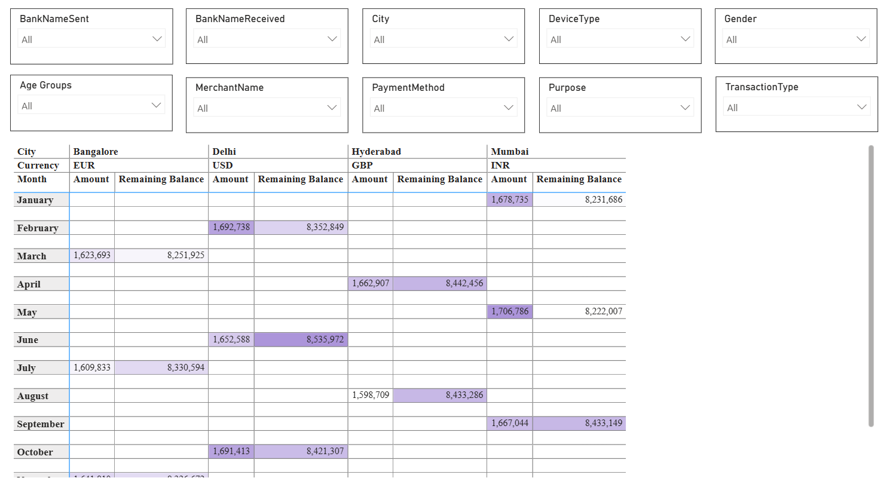

# **UPI Transaction Report**

This project provides a complete analytical overview of **Unified Payments Interface (UPI)** transactions using **Power BI** to uncover trends in digital payments, transaction volumes, and balances across multiple dimensions such as city, bank, gender, device type, and purpose.
The analysis enables financial institutions and digital payment platforms to understand **user behavior, transaction patterns**, and **seasonal financial performance** throughout 2024.

---

## **📂 Project Resources**

**🔗 Dashboard Link:** [View on Power BI](https://app.powerbi.com/groups/me/reports/d7e7dfa4-d59d-42f3-96f3-f72c51b7a494/8d319b843d9a43e12c55?experience=power-bi&bookmarkGuid=a749ac0e600c8821cd0a)

**📊 Dataset Link:** [Download Dataset](https://docs.google.com/spreadsheets/d/1U7mD2by9gz-s5yl03aOv_46x3ad2GNeW/edit?usp=drive_link&ouid=107051437785499956991&rtpof=true&sd=true)

---

## **Problem Statement**

With the rapid increase in digital payments, understanding **transaction flow, frequency, and balance dynamics** is critical for monitoring financial performance and improving customer experience.
This report aims to:

* Analyze **monthly UPI transaction amounts and balances** for the year 2024.
* Identify **high-performing periods and patterns** in digital payments.
* Evaluate **trends across banks, cities, and user demographics** to support data-driven decision-making.
  
---

## **1. Line Chart – Transactions by Month (2024)**

### **Overall Analysis**

* Illustrates **transaction fluctuations across the year** using a line chart for better trend visualization.
* Reveals **cyclical transaction patterns** and potential peaks tied to consumer behavior.

### **Key Insights**

* Peaks in **May (1.70M)** and **October (1.69M)** indicate high seasonal or festival-related activity.
* **March (1.62M)** and **August (1.60M)** display minor dips, suggesting transaction slowdowns.
* The smooth pattern indicates **no extreme volatility**, showing mature user adoption.

### **Recommendations**

* Plan **marketing campaigns** around peak months to leverage natural transaction surges.
* Encourage users through **cashback campaigns** during dips (March, August).
* Use predictive models to **forecast transaction peaks** and optimize server capacity.

---

## **2. Line Chart – Balance by Month (2024)**

### **Overall Analysis**

* Visualizes **monthly balance trends** with clearer seasonal peaks and troughs.
* Shows balances between **8.2M – 8.5M**, aligning closely with transaction performance.

### **Key Insights**

* **June (8.53M)** marks the **highest balance**, likely due to post-fiscal settlements or salary cycles.
* **May (8.22M)** reflects a temporary low before the June surge.
* **November (8.32M)** slightly drops, possibly post-festival spending stabilization.

### **Recommendations**

* Strengthen **data-driven forecasting models** to anticipate balance surges.
* Maintain **infrastructure scalability** during high-transaction months (April–June).
* Track **city-level balance behavior** to identify localized economic activity.

---

## **3. Column Chart – Transactions by Month (2024)**

### **Overall Analysis**

* Represents **monthly transaction counts** throughout 2024, ranging between **1.6M – 1.7M**.
* Indicates **consistent transaction volume** with moderate fluctuations across the months.

### **Key Insights**

* **May (1.71M)** achieved the highest transaction volume.
* **August (1.60M)** recorded the lowest volume, hinting at reduced user activity or seasonal slowdowns.
* Transaction frequency remains above **1.6M per month**, showing **stable UPI adoption** across users.

### **Recommendations**

* Analyze **transaction categories** (merchant vs. peer-to-peer) for low-performing months.
* Introduce **cashback or referral incentives** during weaker months to maintain volume.
* Track **device type and city performance** to identify potential adoption barriers.

---

## **4. Column Chart – Balance by Month (2024)**

### **Overall Analysis**

* Displays **monthly balance trends** for 2024, with average balances ranging between **8.2M and 8.5M**.
* Balances are consistent across the year, showing **stable user engagement and cash flow**.

### **Key Insights**

* **June** recorded the highest balance (8.5M), indicating a strong transactional period mid-year.
* **January and May** observed slightly lower balances (8.2M), possibly due to seasonal spending adjustments.
* Minimal fluctuations throughout the year reflect **steady UPI activity and stable liquidity**.

### **Recommendations**

* Maintain existing **transaction infrastructure** since balances remain stable.
* Conduct **user engagement promotions** in low-activity months (January, May) to balance performance.
* Continue **transaction tracking** to detect anomalies or declining usage early.
  
---

## **5. Transaction Details by City and Currency**

### **Overall Analysis**

* Provides **granular details** of transaction amounts and remaining balances across cities (Bangalore, Delhi, Hyderabad, Mumbai) and currencies (EUR, USD, GBP, INR).
* Highlights **multi-currency activity**, which is critical for understanding cross-border or corporate payments.

### **Key Insights**

* **Bangalore (EUR)** and **Mumbai (INR)** show strong transaction consistency across months.
* **Delhi (USD)** exhibits higher variation, with large spikes in **February and October**, possibly tied to international transactions.
* **Hyderabad (GBP)** maintains moderate but steady contributions.

### **Recommendations**

* Strengthen **currency exchange and remittance partnerships** for Delhi and Hyderabad.
* Monitor **INR flows in Mumbai**, as it represents core domestic activity.
* Evaluate **cross-currency transaction fees and processing times** to enhance performance.

---

## **Key Insights Summary**

| Category               | Observation                                          | Implication                                       |
| ---------------------- | ---------------------------------------------------- | ------------------------------------------------- |
| **Transaction Volume** | Average 1.65M–1.70M per month                        | Indicates widespread UPI usage                    |
| **Balances**           | Consistent 8.2M–8.5M                                 | Stable financial flow throughout 2024             |
| **Top Months**         | May, June, October                                   | High engagement & peak transaction cycles         |
| **Low Months**         | March, August                                        | Need user reactivation strategies                 |
| **Cities**             | Mumbai & Bangalore lead in domestic INR/EUR activity | Strong regional adoption                          |
| **Currencies**         | USD shows fluctuation                                | Potential impact of international payment timings |

---

## **Recommendations Summary**

* Implement **incentive programs** during low transaction months.
* Focus on **cross-currency optimization** for smoother remittance flows.
* Enhance **data analytics tracking** for identifying city-based patterns.
* Continue monitoring **user behavior** through device and payment method filters.
* Use insights for **policy-making, promotional campaigns, and capacity scaling**.

---

## **Conclusion**

The UPI Transaction Data Analysis reveals a **consistent and healthy digital payment ecosystem** throughout 2024.
Balances and transactions remain stable, with **minor seasonal variations** linked to spending cycles and user engagement.
By integrating these insights with **marketing and operational strategies**, digital platforms can sustain growth and improve the **efficiency of financial services delivery**.

